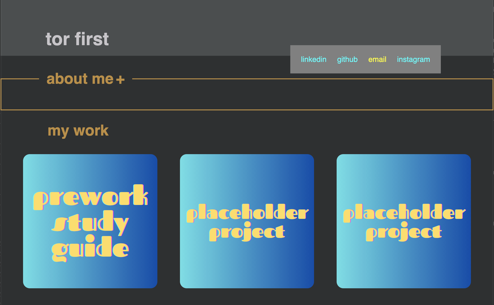
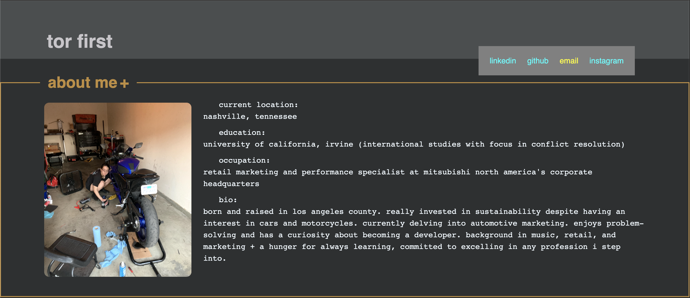

# tor-portfolio

## Description

This project served two purposes: an exercise as I practice my HTML/CSS skills, which would result in a portfolio website that I can use to display my future projects.

Since I had the freedom to create a website tailored to me, I had to learn a lot to execute the design choices I made. Although one of the parameters for this challenge was to include a navigation that scrolls/links to the corresponding section, I opted to make the "About Me" section collapsible to make the portfolio section the main focal point, eliminating the need to scroll down. For this endeavor, I  had to learn how to make the collapsible section open or closed by default because I wasn't sure what I liked visually. I ultimately used the navigation to display my contact links, as I felt like it was a better use of space.

## Installation

There is no installation required for the project, although having a browser installed is required to view the website. The link to the website can be accessed at https://torfirst.github.io/tor-portfolio/.

## Usage

Access the website [here](https://torfirst.github.io/tor-portfolio/). To view the "About Me" section, click on the words, "About Me." To collapse it, simply click again on the words "About Me." Examples below:

 

## Credits

Used the reset.css file provided during UCI Bootcamp in-class activities. One of the BCS tutors, David Elutilo, guided me on resolving an issue where the page was overflowing to the right instead of fitting to the browser.

Referenced [this](https://www.w3schools.com/css/css_link.asp) to figure out how to change the link color for visited and unvisited link.

Used these two links to figure out how to make the “About Me” section collapsible:

[W3 Collapsible How To ](https://www.w3schools.com/howto/howto_js_collapsible.asp)
[Stack Overflow: Collapsible Open By Default](https://stackoverflow.com/questions/52183364/javascript-collapsible-panel-open-by-default)

I also referenced [this MDN article](https://developer.mozilla.org/en-US/docs/Web/CSS/CSS_flexible_box_layout/Basic_concepts_of_flexbox) for general flexbox questions.

## License

Refer to license in repo. However, please **do not** use the profile image for any purposes, including personal and commercial use. Please allow this image of my awkward self to only exist in this one place online. Thank you!
